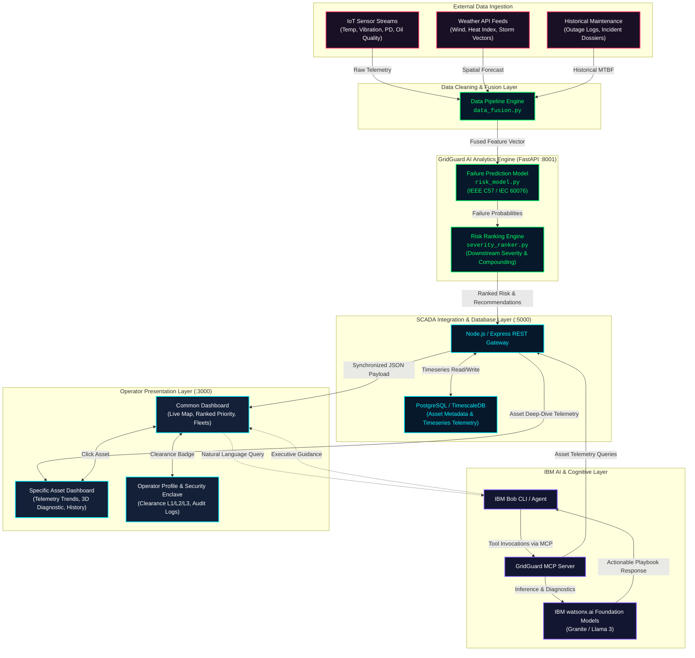

# System Architecture: GridGuard AI

## 1. System Architecture Diagram

The GridGuard AI platform is built upon a resilient, microservice-based architecture that connects IoT edge sensors, weather forecasts, and historical databases to an AI risk engine, an IBM Bob conversational assistant, and an interactive SCADA web console.

---

## 2. Component Table

| Component | Technology | Path / Location | Port / Protocol | Core Responsibilities |
|---|---|---|---|---|
| **Frontend UI** | React 18, TypeScript, Vite, Recharts, Lucide | `src/frontend/` | `http://localhost:3000` (HTTP) | Renders SCADA HUD dashboard, interactive power station canvas background, real-time map, sensor trend charts, and operator profile. |
| **Backend Gateway** | Node.js, Express 4, `pg` driver | `src/backend/` | `http://localhost:5000` (REST) | Serves asset metadata, handles telemetry buffering, coordinates database operations, and manages CORS/proxying. |
| **AI Risk Engine** | Python 3.11+, FastAPI, Pydantic, NumPy | `src/ai-engine/` | `http://localhost:8001` (REST) | Ingests multi-modal data, runs IEEE C57-grounded failure scoring, ranks grid impact severity, and computes crew staging plans. |
| **Database** | PostgreSQL 15+ / TimescaleDB | System Service / Docker | Port `5432` (TCP) | Persists asset inventories, sensor timeseries metrics, weather forecasts, and historical failure records. |
| **IBM Bob Assistant** | IBM Bob CLI, Model Context Protocol (MCP) | Control Room Tooling | STDIO / HTTP | Provides natural language conversational interface for dispatchers to interrogate transformer health and risk root-causes. |
| **watsonx.ai** | IBM Cloud watsonx Foundation Models | Cloud API | HTTPS / TLS 1.3 | Generates structured engineering playbooks, outage mitigation summaries, and regulatory compliance reports. |

---

## 3. End-to-End Data Flow

The lifecycle of grid telemetry moving through the system proceeds in six distinct phases:

### Phase 1: Ingestion & Telemetry Aggregation
1. High-voltage transformers and substation breakers stream continuous readings (top-oil temperature, vibration velocity, partial discharge acoustic signals, and oil quality/DGA) to the SCADA bus.
2. In parallel, regional meteorological services provide 48-hour forward forecasts for wind speed, convective storm vectors, and ambient temperature extremes.

### Phase 2: Multi-Source Harmonization & Data Fusion
1. The **Data Fusion Engine** (`data_fusion.py`) pairs each asset's telemetry records with its geographical weather coordinates and historical maintenance dossier.
2. Missing or delayed sensor pings are imputed using exponential moving averages, and values are normalized against IEEE C57 and IEC 60076 threshold baselines.

### Phase 3: Physics-Informed Failure Prediction
1. The **Failure Prediction Model** (`risk_model.py`) evaluates the composite health score:
   $$\text{Risk} = 0.35 \cdot S_{\text{sensor}} + 0.30 \cdot S_{\text{weather}} + 0.20 \cdot S_{\text{history}} + 0.15 \cdot S_{\text{age}}$$
2. Calculates estimated time-to-failure windows (e.g., $< 14\text{h}$ for critical assets with DGA gas saturation).

### Phase 4: Criticality Ranking & Crew Optimization
1. The **Severity Ranker** (`severity_ranker.py`) scales the raw failure probability by downstream customer count and critical infrastructure weighting (hospitals, emergency services).
2. Generates prioritized work tickets and flags recommended pre-positioning staging areas for repair fleets.

### Phase 5: Cognitive Synthesis via IBM Bob & watsonx.ai
1. Dispatchers in the control room interact with the **IBM Bob Advisor** via voice or text prompts.
2. The Model Context Protocol (MCP) server queries the live GridGuard backend, pulls telemetry snapshots, and passes them to **watsonx.ai** models to produce instant, step-by-step incident containment strategies.

### Phase 6: Mission-Critical Dashboard Rendering
1. The React SCADA console visualizes the ranked priority list, renders live color-coded asset nodes on the grid map, and plots multi-sensor historical trends with zero perceptible latency.

---

## 4. Security Considerations

Operating within electric utility and critical infrastructure environments demands rigorous cybersecurity measures:

- **NERC-CIP Protocol Adherence:** Designed to support North American Electric Reliability Corporation Critical Infrastructure Protection (NERC-CIP-005, CIP-007) electronic security perimeter guidelines.
- **Role-Based Operational Clearance:**
  - **Level 1 (Telemetry Monitor):** Read-only visibility into operational sensor metrics and readouts.
  - **Level 2 (Field Dispatcher):** Authorization to assign and dispatch field repair crews to staging locations.
  - **Level 3 (Chief Controller):** Full authority to approve predictive work orders, alter alarm thresholds, and rotate security clearance keys.
- **Credential & Session Integrity:** Passwords evaluated using real-time industrial complexity scoring (length, uppercase, digits, symbols); authentication keys hashed and stored securely.
- **Simulated Hardware 2FA & Out-of-Band Key Reset:** Password recovery requires verification of cryptographically generated 6-digit one-time passcodes transmitted via simulated out-of-band utility mail channels.
- **Environment Isolation:** Zero credentials or API keys hardcoded into git repositories; all sensitive tokens managed via `.env` files and runtime secrets managers.

---

## 5. Scalability & Deployment Notes

GridGuard AI is built to scale from a single municipal utility to large Regional Transmission Organizations (RTOs):

1. **Stateless Microservices:** The Python FastAPI AI Engine and Node.js REST API maintain no in-memory session state, allowing horizontal auto-scaling behind an NGINX ingress controller or IBM Cloud Code Engine.
2. **Timeseries Hypertables:** Integration with TimescaleDB allows continuous partitioning of high-frequency sensor readings (millions of rows/day) with automated data retention policies and indexed timestamp queries.
3. **Client-Side Edge Resilience:** The React frontend uses an asynchronous fallback engine; if the backend database experiences temporary connectivity disruption during a storm, the dashboard seamlessly transitions to local cached telemetry without interrupting control room workflows.
4. **Containerized Deployment:** Both frontend, backend, and AI engine include standalone container configurations for rapid deployment onto Kubernetes clusters or Red Hat OpenShift.
