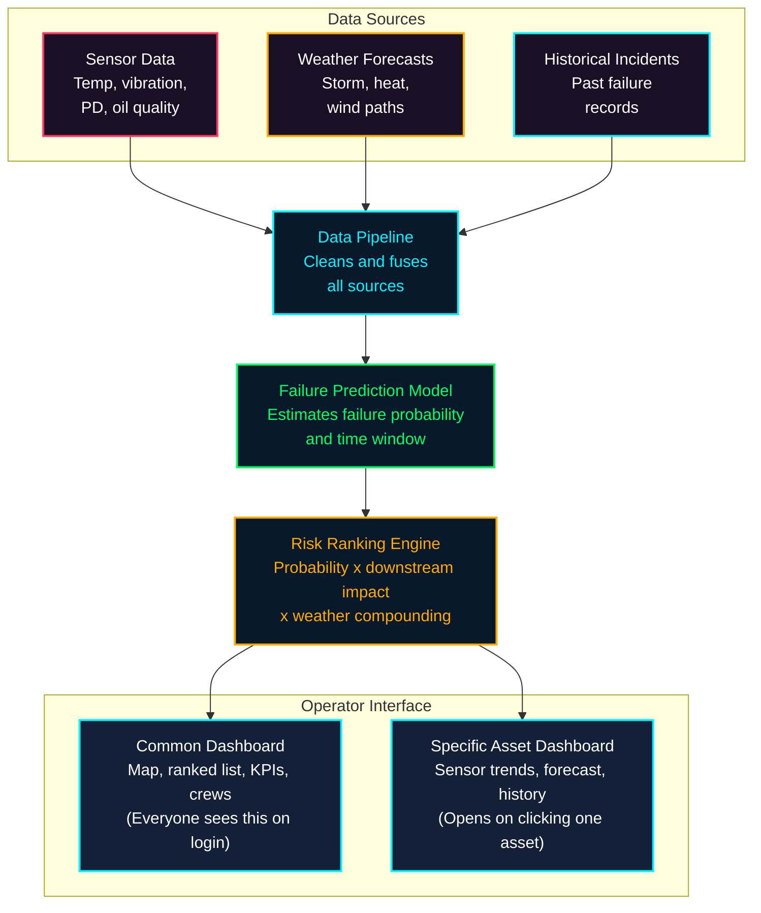

# Solution Overview: GridGuard AI

## 1. What We Built

**GridGuard AI** is a predictive grid resilience platform and equipment failure advisor designed for electric utilities, transmission system operators, and grid maintenance dispatchers. 

By fusing continuous Internet-of-Things (IoT) asset telemetry, hyper-local meteorological forecasts, and historical failure records, GridGuard AI detects early equipment degradation signatures weeks in advance, computes explainable risk scores grounded in IEEE/IEC engineering standards, and automatically coordinates proactive field crew pre-positioning *before* severe weather storms trigger blackouts.

```
       +------------------------------------------------------------------------+
       |                           GRIDGUARD AI                                 |
       |     Power Outage Prediction & Grid Equipment Failure Advisor           |
       +------------------------------------------------------------------------+
              ^                                  |                             ^
              | Telemetry & Weather              | Ranked Risk & Staging       | Real-Time Playbooks
              |                                  v                             |
  +-----------------------+          +-----------------------+     +-----------------------+
  |   IoT Grid Sensors    |          | SCADA Operations Room |     |  IBM Bob / watsonx    |
  | & Meteorological Feeds|          |  Interactive HUD Map  |     |  AI Reliability Agent |
  +-----------------------+          +-----------------------+     +-----------------------+
```

---

## 2. The Core Mechanism

GridGuard AI does not rely on simple threshold triggers or isolated alert flags. Instead, it operates through a continuous, closed-loop analytical pipeline that cleans, models, prioritizes, and prescribes actions.

### The End-to-End Workflow



### 1. Data Cleaning & Multi-Source Fusion (`data_fusion.py`)
- Ingests high-frequency sensor readings: top-oil temperature (°C), tank vibration velocity (mm/s), acoustic/electrical partial discharge (pC), dissolved gas oil quality index (0.0 to 1.0), and electrical load percentage.
- Aligns spatial-temporal coordinates with regional weather models (wind gusts, precipitation rate, ambient heat index, convective storm trajectories).
- Joins the asset's historical maintenance dossier, age in service, and past failure incident logs.

### 2. Multi-Factor Failure Probability Model (`risk_model.py`)
Computes a transparent, multi-factor composite risk score normalized to $[0, 1]$:

$$\text{Risk Score} = w_1 \cdot S_{\text{sensor}} + w_2 \cdot S_{\text{weather}} + w_3 \cdot S_{\text{history}} + w_4 \cdot S_{\text{age}}$$

- **Sensor Health Weight ($w_1 = 0.35$):** Evaluated against standard IEEE C57.104 and IEC 60076 limits.
- **Weather Exposure Weight ($w_2 = 0.30$):** Escalates when forecasted ambient conditions compound equipment stress (e.g., high winds vibrating degraded mechanical bushings, or extreme ambient temperatures preventing transformer cooling).
- **Historical Incident Weight ($w_3 = 0.20$):** Penalizes assets with recurring partial discharge or thermal runaway histories.
- **Age & Degradation Weight ($w_4 = 0.15$):** Non-linear wear curve accounting for insulation paper tensile strength loss over decades.

### 3. Grid Impact Severity Ranking (`severity_ranker.py`)
Not all failing transformers present equal threats to the grid. GridGuard AI ranks operational priority by combining failure likelihood with real-world criticality:

$$\text{Severity Score} = \text{Failure Probability} \times \text{Downstream Grid Impact} \times \text{Weather Compounding Multiplier}$$

- **Downstream Grid Impact:** Customer population served, critical facilities downstream (hospitals, substations, water infrastructure), and megawatt load capacity.
- **Weather Compounding Multiplier:** Real-time atmospheric stress escalation factor ($1.0\times$ to $2.5\times$).

### 4. Prescriptive Maintenance & Crew Pre-Positioning
Transforms abstract risk scores into concrete, actionable engineering work orders:
- Classifies urgency into **IMMEDIATE** ($< 24\text{h}$), **SCHEDULED** ($< 72\text{h}$), or **MONITOR**.
- Recommends specific engineering remediations (e.g., *"Perform DGA oil degassing, replace phase B high-voltage bushing, load shed 15%"*).
- Suggests pre-positioning staging areas for emergency field strike crews before severe weather makes transit impossible.

---

## 3. What Makes It Different from Naive Alternatives

| Capability | Naive Utility Alternative | GridGuard AI |
|---|---|---|
| **Monitoring Basis** | Static alarms on isolated sensors (e.g., alert when temperature $> 85^\circ\text{C}$). | Multi-sensor physics correlation (e.g., cross-referencing DGA gas ratios with vibration harmonics and partial discharge). |
| **Environmental Context** | Unlinked weather radars viewed separately by human operators. | Meteorological feeds directly compound sensor degradation curves in real time. |
| **Asset Prioritization** | Chronological first-in, first-out alarm lists causing operator cognitive overload. | Criticality-ranked priority table factoring downstream population and hospital infrastructure. |
| **Actionability** | Emits vague buzzer alerts with no suggested path to resolution. | Prescribes concrete work orders, required replacement parts, and optimal crew staging coordinates. |
| **AI Explainability** | Opaque black-box models or unassisted human intuition. | Auditable IEEE/IEC-grounded scoring backed by conversational **IBM Bob** root-cause diagnostics. |

---

## 4. Key Design Decisions & Rationale

### Decision 1: Explainable Physics-Grounded Heuristics over Black-Box Deep Learning
- **Rationale:** In high-consequence utility environments, regulatory bodies (NERC-CIP, FERC) and licensed electrical engineers reject unexplainable black-box neural networks. GridGuard AI grounds its failure prediction logic in IEEE C57 and IEC 60076 thresholds, providing full transparency into exactly which factor (temperature, partial discharge, age, or weather) triggered the risk escalation.

### Decision 2: Decoupled Multi-Tier Microservices Architecture
- **Rationale:** 
  - **Python FastAPI (`ai-engine`):** Dedicated to high-speed vectorized scientific computation and statistical feature engineering.
  - **Node.js Express (`backend`):** Dedicated to SCADA event routing, REST API endpoints, and database connection pooling.
  - **React 18 + Vite (`frontend`):** Ultra-responsive, GPU-accelerated SCADA HUD canvas and Recharts visual telemetry rendering at 60 FPS.

### Decision 3: Resilient Offline Fallback Data Engine
- **Rationale:** Live utility control rooms and hackathon evaluation environments frequently operate under constrained network connectivity or local database sandbox restrictions. The frontend and backend include built-in fallback mock datasets modeling 12 realistic utility substations and transformers, ensuring the system remains completely stable and interactive at all times.

### Decision 4: Interactive Generating Station Visuals & SCADA HUD Aesthetic
- **Rationale:** Complex technical data is only effective if operators can absorb it under high-stress conditions. By adhering to a sleek dark SCADA color palette (`#020611` background, `#00f3ff` cyan telemetry, `#00ff66` normal, `#ffaa00` warning, `#ff3333` critical) and an interactive generating station electrical background, GridGuard AI delivers an intuitive, mission-critical experience.

---

## 5. The User Experience (UX)

The user journey is divided into clear, role-based workflows:

```
[Operator Login] ──> [Common Dashboard] ──> [Asset Selection] ──> [Specific Asset Dashboard]
         │                     │                                              │
         v                     v                                              v
   Authentication         Top 10 At-Risk                               Interactive 3D Twin,
  & Profile Studio      Substation Priority                          Multi-Sensor Recharts &
 (Clearance L1/L2/L3)   & Fleet Dispatch                              IBM Bob AI Mitigation
```

### 1. Common Dashboard (Global Grid Command)
*Every operator sees this upon logging into the terminal:*
- **Interactive Grid Map:** Geospatial view displaying 12 primary high-voltage substations, transformer banks, and breaker nodes color-coded by real-time risk level.
- **Ranked Criticality Table:** Live table re-sorting assets by compound risk score, driving signals, and predicted time-to-failure window.
- **Executive KPIs:** Aggregate grid health index, total active field crews, severe weather exposure level, and NERC-CIP compliance status.
- **Fleet Dispatch Logistics:** Real-time location and assignment status of specialized strike teams (e.g., Heavy Transformer Crew 03).

### 2. Specific Asset Dashboard (Deep-Dive Diagnostics)
*Opens instantly upon selecting any substation or transformer:*
- **Multi-Sensor Trend Telemetry:** Real-time small-multiple charts showing historical and current readings for temperature, vibration, partial discharge, and oil quality.
- **Weather Exposure Forecast:** Hyper-local wind speed, precipitation, and compounding risk multiplier for that specific asset coordinate.
- **Historical Incident Matcher:** Signature match against previous utility outages (e.g., *"87% signature correlation with Northside Substation June 2024 failure"*).
- **IBM Bob Conversational Assistant:** Dispatchers can ask questions in natural language: *"Why is Northside Substation Alpha at critical risk?"* and receive immediate, IEEE-grounded mitigation playbooks.

### 3. Operator Profile & SCADA Security Enclave
- Access clearance credential management (Level 1 Monitor, Level 2 Dispatcher, Level 3 Chief Controller).
- Live role-switcher for demonstration simulations.
- Immutable NERC-CIP audit log trail recording every acknowledged alert and dispatched repair crew.
